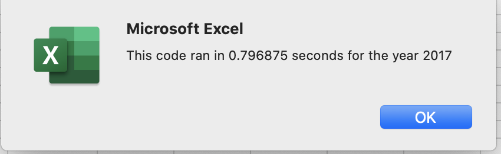

# Stock Analysis

## Overview of Project
Initially, our client wanted to analyze 12 stocks of green energy companies, with a specific interest in DQ, for their return and total daily volume for 2017 and 2018.  We have additionally been tasked with refactoring the code to be more efficient and faster, as Steve wants a macro to return analysis on the entire stock market over the last few years.

## Results

- VBA code

An important step to make this code more efficient was to create a series of arrays in addition to our already existing array for tickers. So, we created three arrays, tickerVolumes, tickerStartingPrices, and tickerEndingPrices, to avoid creating the three separate variables for the values we would need to calculate our desired outputs. To make these arrays functional, we had to create a tickerIndex as well in order to properly reference the desired stocks.

Additionally, in our updated version we were able to avoid using nested loops to find the three values for each stock.

- 2017 vs. 2018

As shown below, all 12 selected stocks of green energy companies had positive returns, except for TERP which had a return of -7.2%. DQ, the stock of particular interest to our client, had the highest yearly return at 199.4%.

Conversely, 2018 was a poor growth year for these companies with only ENPH and RUN having positive returns. These two stocks significantly outperformed the others in both return and trading volume. Additionally, only half of the stocks decreased in total daily volume. 

 

- Refactored
 

- Original
 

It is clear that the refactored code was significantly more efficient performing the same analysis, and it returned the same values as the original function.

## Summary

- What are the advantages or disadvantages of refactoring code?
Refactoring can greatly improve an existing code, as it can be made more legible through design, more efficient by using less memory, and faster for its users. However, if the code is not initially understood before it is refactored, it can lead to errors and a broken code.

- How do these pros and cons apply to refactoring the original VBA script?
The codes effectively output the same results for a given stock's yearly return percentage and total daily volume in its respective year. However, it was time consuming to figure out a new structure and logic for our new code, so depending on when the clients were intent on making their investment, the delivery of the analysis may have been delayed.